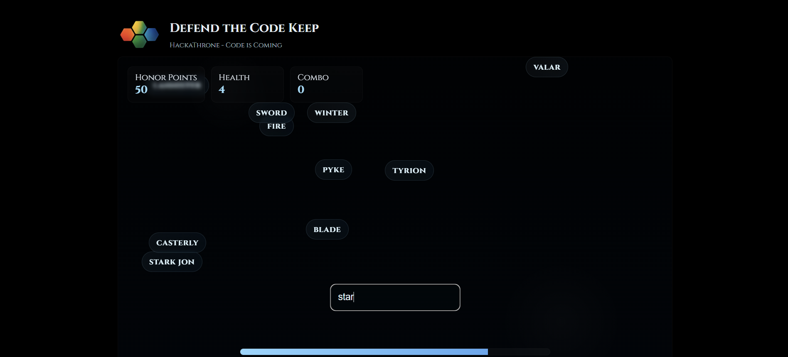
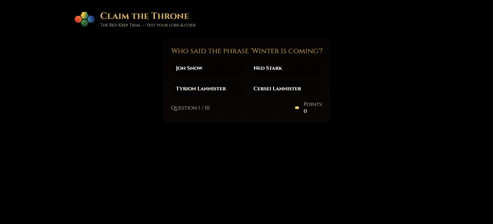

# Club Expo — HackaThrone 

A Game of Thrones-themed interactive web experience built for a club expo event. Features two standalone browser-based mini-games that run entirely without a backend.

---

## Screenshots




---

## Contents

| File | Description |
|------|-------------|
| `expo.html` | **Defend the Code Keep** — A typing/word-shooting game where players destroy incoming bugs to protect the castle |
| `Quiz.html` | **Claim the Throne** — A timed multiple-choice quiz testing coding knowledge and GoT lore |
| `logo.png` | Club logo used in both pages |

---

## Games

### Defend the Code Keep (`expo.html`)
A typing arcade game set against a dark medieval backdrop. Bug-labeled words fall from the top of the screen; players type them to destroy the bugs before they breach the castle walls. Includes a HUD with score tracking and a leaderboard to compare results.

- **Theme:** *HackaThrone — Code is Coming*
- **Mechanic:** Type the displayed word correctly to eliminate it
- **Features:** Score counter, castle health bar, leaderboard, animated hit effects

### Claim the Throne (`Quiz.html`)
A 10-question timed quiz styled after the Red Keep. Each question has a 15-second countdown timer and 4 answer choices. A title is awarded at the end based on the player's final score.

- **Theme:** *The Red Keep Trial*
- **Mechanic:** Select the correct answer before the timer runs out
- **Scoring:** +10 points per correct answer (max 100)

---

## Usage

No installation or server required. Just open either HTML file directly in a browser:

```bash
# Option 1: Open directly
open expo.html
open Quiz.html

# Option 2: Serve locally (avoids any asset path issues)
python3 -m http.server 8000
# Then visit http://localhost:8000/expo.html
```

> Make sure `logo.png` is in the same directory as the HTML files.

---

## Tech Stack

- Vanilla HTML, CSS, JavaScript (no frameworks or dependencies)
- [Cinzel](https://fonts.google.com/specimen/Cinzel) font via Google Fonts
- Fully self-contained single-file pages